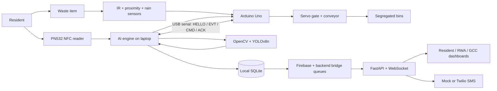

# SmartSeg

SmartSeg is an offline-first AI waste-segregation station for residential societies. It identifies residents by NFC, classifies a waste item with computer vision, directs it to the correct bin through an Arduino-controlled conveyor, and turns responsible disposal into reward points. Residents see their wallet and history, RWAs see society performance, and civic-body users get a clear compliance view—without losing a cycle when internet connectivity disappears.

## Architecture



## Features

- Trigger-based YOLOv8n classification with proximity/rain sensor context.
- Reliable Arduino serial protocol with ACKs, retries, duplicate-event protection, and reconnect handling.
- Separate PN532 serial NFC reader with backend lookup and local SQLite fallback.
- Local-first SQLite event storage, Firebase sync queue, and persistent dashboard-notification queue.
- Reward engine with category multipliers and low-confidence penalty; wallet ledger and demo redemption.
- JWT-protected resident, RWA, GCC, and admin APIs plus WebSocket live feed.
- Role-specific React dashboards and NFC card-registration console.
- `SMARTSEG_SIMULATE_MODE=true` for a complete no-hardware expo demo.

## Tech stack

| Layer | Technology |
| --- | --- |
| Vision and device orchestration | Python 3.11, OpenCV, Ultralytics YOLOv8n, pyserial |
| Hardware | Arduino Uno C++, IR/proximity/rain sensors, SG90 servo, L298N motor driver, PN532 serial NFC bridge |
| Backend | FastAPI, SQLAlchemy, SQLite, python-jose JWT, Firebase Admin SDK |
| Frontend | React 18, Vite, TailwindCSS, Recharts, Lucide |
| Notifications | Mock SMS by default; Twilio optional |

## Quick start

### Install

```powershell
# From the project root (Windows)
py -3.11 -m venv .venv
.\.venv\Scripts\Activate.ps1
pip install -r ai-engine\requirements.txt
pip install -r backend\requirements.txt
cd frontend
npm install
cd ..
```

```powershell
Terminal 1 (ai-engine): cd ai-engine → python main.py
Terminal 2 (backend): cd backend → uvicorn main:app --reload
Terminal 3 (frontend): cd frontend → npm run dev
```

On macOS/Linux, use `python3.11 -m venv .venv`, `source .venv/bin/activate`, and `bash start_all.sh`. 
For firmware, install Arduino IDE 2.x, select **Arduino Uno**, and upload [smartseg_firmware.ino](arduino-firmware/smartseg_firmware.ino).

### Configure

| Variable | Required? | Purpose / default |
| --- | --- | --- |
| `SERIAL_PORT` | Hardware only | Arduino port, e.g. `COM3`. |
| `NFC_SERIAL_PORT` | Hardware only | PN532 bridge port, e.g. `COM4`. |
| `YOLO_MODEL_PATH` | Hardware inference only | Model path; defaults to `yolov8n.pt`. |
| `MOCK_MODE` | Optional | Defaults to `true`; use simulated device adapters. Set `false` for hardware. |
| `SMARTSEG_SIMULATE_MODE` | Optional | Set `true` for a complete timed, no-hardware demo. |
| `SMARTSEG_BACKEND_URL` | Optional | Backend URL; defaults to `http://localhost:8000`. |
| `SMARTSEG_BACKEND_API_TOKEN` | Live bridge | JWT allowed to call `/waste/event`; retries persist locally if unavailable. |
| `SMARTSEG_NFC_API_TOKEN` | NFC backend lookup | JWT for `/nfc/scan`; SQLite lookup is the offline fallback. |
| `DATABASE_URL` | Optional | SQLite URL; default is project-root `smartseg.db`. |
| `JWT_SECRET` | Production required | Replace the development default before deployment. |
| `VITE_API_BASE_URL` | Optional | Browser API URL; default `http://localhost:8000`. |
| `FIREBASE_CREDENTIALS_PATH` | Optional / off by default | Service-account JSON; also set `SMARTSEG_SYNC_ENABLED=true`. |
| `TWILIO_ACCOUNT_SID`, `TWILIO_AUTH_TOKEN`, `TWILIO_FROM_PHONE` | Optional / off by default | Required only with `SMARTSEG_SMS_PROVIDER=twilio`. Mock SMS is default. |
| `ADMIN_PHONE` | Optional | Destination for unregistered-card alerts. |

### Launch

```bash
bash start_all.sh
```

On Windows run `start_all.bat`. Logs are prefixed `[AI]`, `[BACKEND]`, and `[FRONTEND]`; Ctrl+C stops all services. 
Open [the dashboard](http://localhost:5173) and [API docs](http://localhost:8000/docs). 
For the safest presentation fallback, set `SMARTSEG_SIMULATE_MODE=true` before launch.

## Known limitations

- Weight is currently simulated; a calibrated HX711 load cell is not yet connected.
- Analytics are single-society; GCC multi-society aggregation is only structurally prepared.
- NFC UID alone can be cloned and is not strong production authentication.
- YOLOv8n has limited accuracy for unusual, dirty, occluded, or locally specific waste items without fine-tuning.
- The prototype has no HTTPS, token refresh/revocation, WebSocket authentication, or full production hardening.

## Future improvements

- Add real load-cell measurement, more waste categories, and safe hazardous-waste routing.
- Add multi-society tenancy, resident mobile app, and redemption catalogue.
- Use encrypted NFC tags or NFC + PIN for stronger identity verification.
- Package the laptop software as an edge appliance for managed deployments.
- Fine-tune a larger YOLO model on an Indian household-waste dataset and integrate municipal systems.
